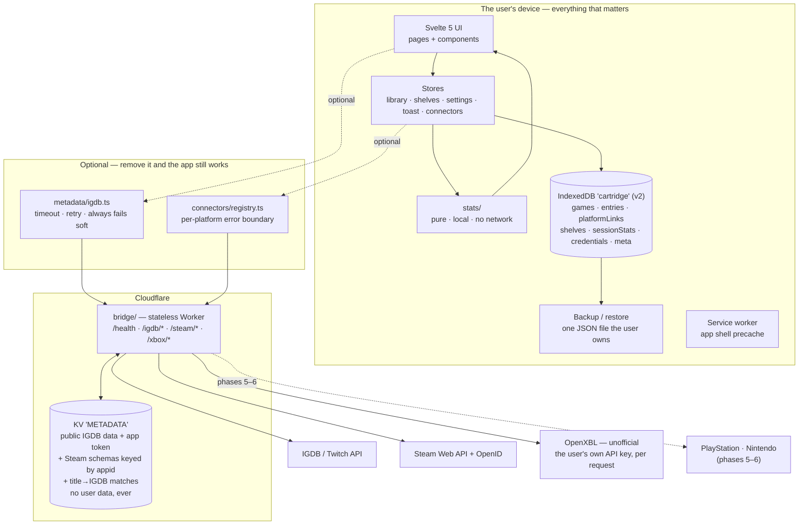

# Cartridge — architecture

## The four non-negotiables

Everything below exists to serve these. If a change breaks one of them, the change is
wrong, however convenient it is.

None of the four is Cartridge's own invention. Each is an instance of a ratified principle
owned by [jrmoulckers/engineering](https://github.com/jrmoulckers/engineering); the citation
names the rule, and the sentence after it is the product-specific part — what "offline" or
"degrades" concretely means for a games library, and where a test proves it.

1. **The app works fully offline with zero connectors attached.**
   [`ENG-LOCAL-001`](https://github.com/jrmoulckers/engineering/blob/main/principles/platforms/local-first.md)
   and [`ENG-LOCAL-004`](https://github.com/jrmoulckers/engineering/blob/main/principles/platforms/local-first.md).
   Cartridge-specific: not "degrades gracefully" — _works_. Boot, add a game, shelve it, rate
   it, review it, search it, back it up: all of it, with no network and no accounts. Enforced
   by `src/lib/offline.test.ts`, which stubs `fetch` to reject and asserts it is never called.

2. **No credential leaves the device except to the bridge, per request.**
   [`ENG-SEC-001`](https://github.com/jrmoulckers/engineering/blob/main/principles/assurance/security-and-privacy.md)
   and [`ENG-WEB-001`](https://github.com/jrmoulckers/engineering/blob/main/principles/platforms/browser-frontend.md).
   Cartridge-specific: platform credentials live in IndexedDB on the user's device. A
   connector may send one to the bridge to make a call that requires it, for the duration of
   that call. Nothing else.

3. **The bridge never persists a user's library.**
   A Cartridge convention, not a ratified rule; the obligation beneath it is
   [`ENG-SEC-008`](https://github.com/jrmoulckers/engineering/blob/main/principles/assurance/security-and-privacy.md) — its data-minimization half only.
   The lifecycle-evidence half does not bind here, and that is the point: storing nothing
   personal means there is no collection, retention, export or deletion to produce evidence
   for. [`ENG-SEC-004`](https://github.com/jrmoulckers/engineering/blob/main/principles/assurance/security-and-privacy.md)
   _additionally_ holds the bridge's own credentials to least authority.
   Cartridge-specific: it caches public IGDB metadata and its own Twitch app token. It has no
   endpoint that accepts user data, no cookies, no identifiers, no request-body logs.

4. **A failing connector degrades one tab, never the whole app.**
   [`ENG-LOCAL-004`](https://github.com/jrmoulckers/engineering/blob/main/principles/platforms/local-first.md);
   see [resilience](https://github.com/jrmoulckers/engineering/blob/main/practices/resilience.md).
   Cartridge-specific: enforced structurally by `src/lib/connectors/registry.ts`, which
   catches everything a connector can throw, records it against that platform alone, and
   returns it as a value. Proven by `registry.test.ts`.

## The shape of it

The dotted edges are the whole design: everything outside `device` can be deleted and the
product still does its job.

## Layers

The direction of the arrows is
[`ENG-ARCH-001`](https://github.com/jrmoulckers/engineering/blob/main/principles/architecture/boundaries-and-contracts.md)
— see [frontend layering](https://github.com/jrmoulckers/engineering/blob/main/practices/frontend-layering.md).
What follows is where each boundary lands in this repo.

| Layer      | Path                                                                                  | Rule                                                                                            |
| ---------- | ------------------------------------------------------------------------------------- | ----------------------------------------------------------------------------------------------- |
| Types      | `src/lib/types.ts`                                                                    | The domain vocabulary. No behaviour.                                                            |
| Storage    | `src/lib/storage/db.ts`                                                               | The only module that touches IndexedDB.                                                         |
| Backup     | `src/lib/storage/backup.ts`                                                           | The `cartridge/backup` envelope, and the guard against restoring a foreign file.                |
| Stores     | `src/lib/stores/*`                                                                    | The only thing components talk to for persisted data. Writes go to `db` first, then refresh.    |
| Pure logic | `src/lib/library/*`, `src/lib/stats/*`, `markdown.ts`, `util.ts`, `metadata/match.ts` | No DOM, no IO. Unit-tested directly.                                                            |
| Metadata   | `src/lib/metadata/*`                                                                  | The only code in the app that makes a network request.                                          |
| Connectors | `src/lib/connectors/*`                                                                | Interface + error boundary + implementations. `sync.ts` is pure; `apply.ts` is the only writer. |
| UI         | `src/lib/components/*`, `src/lib/pages/*`                                             | Presentation. Reaches persisted data only through a store — never IndexedDB, never the network. |
| Bridge     | `bridge/`                                                                             | Separate deployable, own tsconfig, own release cadence.                                         |

Five of those rules are executable, not aspirational: `npm run check:boundaries` proves that the
pure layer performs no IO, that `src/lib/metadata` is the only caller of `fetch`, that
`connectors/sync.ts` stays pure, that `storage/db` is reachable only from the stores and
`connectors/apply.ts`, and that no component or page touches persistence directly. It runs in CI.

The rules are stated by **file kind rather than directory** on purpose. "Nothing under `lib/`
imports the framework" is the kind of claim that is true when written and quietly false the day
someone colocates a component next to the logic it renders. Each rule also reports how many files
it selected, so a glob that stops matching fails loudly instead of passing vacuously.

## Data model

IndexedDB database `cartridge`, version 3. Merge behaviour follows
[`ENG-LOCAL-003`](https://github.com/jrmoulckers/engineering/blob/main/principles/platforms/local-first.md)
— see [local-first sync](https://github.com/jrmoulckers/engineering/blob/main/practices/local-first-sync.md).

Cartridge-specific: every record carries `id`, `createdAt`, `updatedAt` and an optional
`deleted` tombstone, the same per-entity shape `score-king` uses. Nothing merges yet, but
backups already round-trip tombstones, so a future sync layer drops in without a migration.

| Store                  | Key        | Indexes                           | Holds                                                                                                                                                             |
| ---------------------- | ---------- | --------------------------------- | ----------------------------------------------------------------------------------------------------------------------------------------------------------------- |
| `games`                | `id`       | `bySortTitle`, `byIgdbId`         | Canonical metadata, authored or IGDB-sourced.                                                                                                                     |
| `platformLinks`        | `id`       | `byGame`, `byPlatform`            | Game ↔ Steam appid / Xbox titleId / PSN id / Nintendo id.                                                                                                         |
| `entries`              | `id`       | `byGame`, `byStatus`, `byUpdated` | The user's relationship to a game.                                                                                                                                |
| `shelves`              | `id`       | `byOrder`                         | Five built-ins plus custom.                                                                                                                                       |
| `sessionStats`         | `id`       | `byGame`                          | Synced playtime, last-played, achievements — always the _latest_ reading.                                                                                         |
| `playtimeObservations` | `id`       | `byLink`, `byObservedAt`          | Append-only history of what each platform reported, and when. **Written on every sync, read by nothing yet — see below.**                                         |
| `credentials`          | `platform` | —                                 | Platform credentials — for Steam a 64-bit account id, for Xbox the user's own OpenXBL API key plus their XUID and gamertag. **Excluded from backup and restore.** |
| `meta`                 | `key`      | —                                 | Schema version and app-level odds and ends.                                                                                                                       |

`credentials` (added in v2) is deliberately outside the backup envelope. A backup is a file
people email themselves and drop in cloud storage; an account credential does not belong in
one, and re-connecting a platform takes two clicks. Phase 4 made that reasoning literal rather
than precautionary: Xbox's credential is a long-lived API key, not a public account number.
The visible cost is that a restore brings
back platform links with no account behind them, so `needsReconnect` derives that state from
the library and shows a reconnect prompt rather than letting a sync silently do nothing.

Deletes are **tombstoned cascades** — Cartridge's instance of `ENG-LOCAL-003`'s tombstone
rule: removing a game marks the game, its entry, its links and its stats as deleted rather
than dropping rows, so a restore on another device learns about the deletion too.

The whole library is loaded into memory on boot. A personal games library is small, and
holding it in memory is what makes search instant and every screen work offline.

### `playtimeObservations` is write-only on purpose — do not remove it

**This store is read by no feature. That is intentional, and it is not dead code.**

Steam and Xbox report a _lifetime_ playtime total and a last-played date. Neither windows
playtime to a period, which is why the year in review refuses to claim hours-played-in-a-year
(see [Statistics](#statistics-phase-7)). The difference between two readings of a lifetime
total **is** the playtime between them — so on every sync, at the one point in `apply.ts`
where playtime enters the database, the reading is appended here alongside the `SessionStat`
it updates.

The value of this store is strictly a function of how early it started. It can only ever
answer for the window it has been collecting over, so it collects from v3 onward whether or
not anything is ready to ask. Deleting it as unused would not free a feature's worth of code;
it would throw away time that cannot be re-fetched, and reset the clock on the first honest
"hours this year" to whenever someone re-adds it.

It also repairs a second, quieter loss. A platform reports only the **last** time you played
a game, so replaying something in 2026 silently erases the evidence that 2025 ever touched
it. `SessionStat` is overwritten; the observation log remembers.

Four rules hold it together:

| Rule                                                      | Why                                                                                                                                                         |
| --------------------------------------------------------- | ----------------------------------------------------------------------------------------------------------------------------------------------------------- |
| Append-only — no update, no delete, no tombstone.         | A row is a fact about a moment. Editing it would be rewriting history, not correcting it.                                                                   |
| Keyed by `platform` + `externalId`, not `gameId`.         | It records what the _platform_ said, so merging, deleting, re-linking or re-matching a game leaves the history underneath intact.                           |
| A `null` reading writes nothing; a real `0` writes a row. | A reading with no number can never take part in a subtraction. A zero is a genuine reading, and the `0` ≠ `null` distinction holds here as everywhere else. |
| Carried in backups, unlike `credentials`.                 | It is the one thing in the database a user cannot rebuild — a lifetime total can be re-fetched, last March's reading cannot.                                |

Nothing is pruned. A row per game per sync is small; if that ever stops being true, collapsing
runs of identical `minutesPlayed` is the obvious fix and stays available.

## The bridge

A stateless Cloudflare Worker. It exists because IGDB requires a client secret a static PWA
cannot hold, and because neither the Steam Web API nor OpenXBL will answer a browser directly.
It is Cartridge's instance of
[`ENG-INT-005` (Credential proxy isolation)](https://github.com/jrmoulckers/engineering/blob/main/principles/platforms/integration-boundaries.md):
a narrow proxy holding the third-party credentials, with an explicit origin allowlist
(`bridge/src/cors.ts` — no wildcard, no pattern matching), an explicit operation allowlist
(every route matched by name in `bridge/src/index.ts`, default-deny 404), and no user-data
persistence.

- **Auth**: Twitch client-credentials, token cached in KV until shortly before expiry,
  never returned to the client. Xbox needs no bridge secret — the key is the user's and
  arrives per request.
- **Normalization**: IGDB responses are mapped to Cartridge's `GameMetadata` in the worker.
  The app never sees an IGDB field name, so an upstream schema change is a bridge deploy.
- **Cache**: search 24h, game 7d in KV; `Cache-Control` echoed to the browser. Steam
  achievement schemas and appid → IGDB mappings cache for 30 days, keyed by appid, and
  title → IGDB matches for 7 days keyed by the normalised title — public
  facts about a game, not about a person. Every entry is keyed, TTL-bounded and versioned
  rather than invalidated, per
  [`ENG-INT-002` (Explicit seam caches)](https://github.com/jrmoulckers/engineering/blob/main/principles/platforms/integration-boundaries.md);
  none of it is a source of truth, and a cold cache changes latency, not answers.
- **Hardening**: exact-match CORS allowlist, `GET` only, bounded input, per-IP throttle, one
  error envelope, no upstream stack traces.

The allowlist stops browsers, not `curl` — `Origin` is a header, and a header is whatever the
sender says it is. So a deployed bridge is, in practice, an open Steam and IGDB proxy backed
by the deployer's keys for anyone who learns the URL and an allowed origin. Closing that needs
real authentication, which needs an account system Cartridge deliberately doesn't have.
`bridge/README.md`'s "Residual risk" section spells this out so nobody deploys it without
knowing. Xbox is the exception that proves the shape of the problem: there is no bridge-held
Xbox key to spend, so `/xbox/*` is useless to a caller who hasn't brought their own.

**No cache key contains a SteamID, an XUID or an OpenXBL key, and no user's library is ever
written to KV.** A library and its playtime are personal, and the whole point of the bridge is
that it brokers keys, not that it holds data. Steam and Xbox library calls pass straight
through, `no-store`.

See `bridge/README.md` for the secrets and how to obtain them.

## Connectors

Connectors are Cartridge's instance of
[`ENG-LOCAL-002`](https://github.com/jrmoulckers/engineering/blob/main/principles/platforms/local-first.md):
one narrow provider contract that core local operation never waits on. Each implementation is
the thin single-purpose adapter
[`ENG-INT-001`](https://github.com/jrmoulckers/engineering/blob/main/principles/platforms/integration-boundaries.md)
asks for — provider quirks are parsed into Cartridge's own types at the edge and go no further.

A connector answers four questions about a platform — who you are, what you own, what you've
played lately, and how far through the achievements you are — and nothing else. The registry
wraps every call in a boundary that turns a throw into a value, so a platform that is down,
rate-limited or returning nonsense degrades that platform's tab and nothing else.

Syncing is deliberately two steps:

1. **Plan** — `connectors/sync.ts`, pure. Takes the library, what the platform reports and
   what IGDB matched, and returns a `SyncPlan`: what would be added, what already exists and
   would gain a link, what is unchanged, what couldn't be identified. No DOM, no IndexedDB,
   no network — which is why the rules that matter can be proven rather than promised.
2. **Apply** — `connectors/apply.ts`, a thin writer. Creates games, links and stats; creates
   an `Entry` for a genuinely new game and **never modifies an existing one**. A plan has no
   vocabulary for changing a rating, a review, a status or a shelf, so it cannot.

Identification runs in descending order of trust: an existing platform link, then a shared
IGDB id, then `metadata/match.ts`'s conservative title matcher. `null` is a good answer — an
unrecognised game becomes a new row, which is a small annoyance, where a wrong match silently
merges two games and takes a rating and a review with it.

The corollary took a review to spot. A game imported *un*identified — no `igdbId`, the
platform's own title and art — leaves only the fuzzy matcher standing between it and the next
platform that reports the same game, which is the duplicate the whole model exists to prevent
arriving from behind. So a confident identification **upgrades the row it finds** rather than
walking past it: the `igdbId` is stamped on and blank fields are filled, and any field that
already has a value, including the title, is left exactly as it was. Filling a blank is new
knowledge; replacing a value is an opinion about someone else's library.

### Steam (phase 3)

| Piece            | Where                                                                                                                                                                                                                                   |
| ---------------- | --------------------------------------------------------------------------------------------------------------------------------------------------------------------------------------------------------------------------------------- |
| Sign-in          | Steam OpenID 2.0, verified in the worker. The app redirects to `/steam/login`, Steam returns to `/steam/return`, and the bridge answers by redirecting back with `#steam_id=…` in the fragment — which browsers never send to a server. |
| Verification     | `openid.mode`, `op_endpoint`, `return_to` and a `check_authentication` round-trip to Steam that must answer `is_valid:true`. The redirect's own parameters are never trusted.                                                           |
| Credential       | A 64-bit SteamID. That is the entire secret, and it is public information.                                                                                                                                                              |
| Data             | `GetOwnedGames`, `GetRecentlyPlayedGames`, `GetPlayerAchievements` + `GetSchemaForGame`.                                                                                                                                                |
| Matching         | `/igdb/by-steam` resolves appids through IGDB's `external_games`, so matching is near-exact rather than by title.                                                                                                                       |
| Private profiles | Steam answers `{"response":{}}` with HTTP 200. The bridge detects it and returns `403 steam-private` with a help URL; the app shows the exact privacy setting to change.                                                                |

### Xbox (phase 4)

The second connector, and the one that tested whether the interface generalised. It mostly
did: three **additive** changes were all it needed — the evolution
[`ENG-ARCH-002`](https://github.com/jrmoulckers/engineering/blob/main/principles/architecture/boundaries-and-contracts.md)
asks for — `Capabilities.playtimeCoverage`,
`ConnectorGame.achievements` and `SyncPlan.matchingIncomplete`. Each is documented where it is
declared, with the Xbox fact that forced it.

| Piece      | Where                                                                                                                                                                                                                                                                        |
| ---------- | ---------------------------------------------------------------------------------------------------------------------------------------------------------------------------------------------------------------------------------------------------------------------------- |
| API        | [OpenXBL](https://xbl.io/), an **unofficial** third-party proxy over Xbox Live. There is no public Microsoft alternative. `capabilities.official` is `false` and the UI says so.                                                                                             |
| Credential | The user's **own** free OpenXBL API key, created with their Microsoft login. Sent in an `X-XBL-Key` header — a header rather than a query parameter so a long-lived secret stays out of URLs, access logs and history. The bridge holds no Xbox secret at all.               |
| Data       | `/account`, `/player/titleHistory` (games, last-played **and** achievement counts inline), `/player/stats` (minutes, batched), `/achievements/player/{xuid}/{titleId}`.                                                                                                      |
| Budget     | 150 requests/hour on the free tier. A full sync is about three, because achievements ride along with the library and playtime batches. A throttled sync keeps what it fetched instead of failing whole.                                                                      |
| Matching   | **The hard part.** IGDB carries no Xbox title ids, so games are matched by title through `/igdb/by-title` at ≥ 0.94 similarity _and_ 0.06 clear of the runner-up. An ambiguous title is refused, imported under Xbox's own name, and listed for review on the import screen. |
| Playtime   | Often absent — `null` → "Not reported". Never a fabricated `0`, and never allowed to erase a figure a previous sync already recorded.                                                                                                                                        |
| Ownership  | Title history is what has been _played_, not what is _owned_. A never-launched purchase is simply absent, and Cartridge does not invent it.                                                                                                                                  |

## Statistics (phase 7)

Pulled forward ahead of the PlayStation and Nintendo connectors, because two connectors were
enough to prove the model and nothing yet paid the user back for the data.

`src/lib/stats/` is pure in the same sense `library/search.ts` is — no DOM, no IndexedDB, no
network — and it is the _only_ feature in the app that adds no capability to the bridge. The
figures come out of memory, so the whole surface works offline with zero connectors, which
`stats/local.test.ts` asserts with `fetch` stubbed to reject.

| Module             | Holds                                                                          |
| ------------------ | ------------------------------------------------------------------------------ |
| `stats/types.ts`   | `Measure<T>` — a value plus `covered` / `total` — and the distribution shapes. |
| `stats/compute.ts` | `computeStats()`: one O(n) pass producing every library-wide measure.          |
| `stats/year.ts`    | The year rule: which dated facts put a game in a year, and `yearInReview()`.   |
| `stats/backlog.ts` | Triage: never-launched vs unknown vs already-begun.                            |
| `stats/format.ts`  | The wording of every coverage sentence, in one testable place.                 |

### The design problem: a number with no denominator is a lie

Cartridge's data is structurally incomplete on purpose. Steam reports playtime, Xbox reports
it for some titles, PlayStation reports none. A game can be finished with no finish date or
rated with no review. So the type system is what stops a partial number being rendered as a
complete one: a component is handed a `Measure`, never a bare figure, and cannot show "412
hours" without the "across 38 of your 91 games" that makes it true. A measure that cannot be
computed honestly is `null` **with a reason**, and the UI renders the reason where the number
would have gone. `null` playtime is never summed as `0`; a real `0` is counted separately,
because "owned, never launched" is a genuine and interesting fact.

The wording lives in `format.ts` rather than in the two pages, so honesty is a tested function
instead of fifty strings that drift by the third change. A _complete_ measure renders no
coverage sentence at all — "across 91 of your 91 games" is noise, and noise trains people to
skip the sentence on the measures where it matters.

### The year rule

A game is in year Y when a dated fact falls in Y, locally: `entry.finishedAt`,
`entry.startedAt`, any replay date, or a `sessionStat.lastPlayedAt`. Three consequences, each
stated on the page rather than hidden:

| Consequence                                                                      | Why                                                                                                                                                                                                                                                                                             |
| -------------------------------------------------------------------------------- | ----------------------------------------------------------------------------------------------------------------------------------------------------------------------------------------------------------------------------------------------------------------------------------------------- |
| An undated game is in **no** year, and is counted as such.                       | `createdAt` is a fact about an import, not about playing. Back-filling from it would fill the page with confident nonsense.                                                                                                                                                                     |
| `lastPlayedAt` is _last_, not _every_ — a 2027 session removes a game from 2026. | It is the only signal the platforms give, and the alternative is not having one.                                                                                                                                                                                                                |
| **Hours played in a year are never claimed.**                                    | Nothing in `SessionStat` windows playtime to a period; the figure does not exist to be computed. The page reports _lifetime_ playtime behind the year's games, labelled as such. `playtimeObservations` is the groundwork for changing that — but only for windows it has been collecting over. |

The same reasoning omits "biggest surprise" (no expectation is ever recorded, so a proxy would
be fabricated) and any HowLongToBeat-style length estimate (no HLTB integration, and IGDB has
no reliable completion times).

### Performance and payload

The delivery budget is
[`ENG-WEB-003`](https://github.com/jrmoulckers/engineering/blob/main/principles/platforms/browser-frontend.md),
enforced in CI by the `perf` job's `bundle-budget-kb` — see
[performance budgets](https://github.com/jrmoulckers/engineering/blob/main/practices/performance-budgets.md).

`computeStats` is one pass with no sorting inside the loop; `compute.test.ts` asserts a
2,000-game library stays inside a bound, which is why the pages compute in a `$derived`
instead of behind a scheduler. The two screens are `import()`ed on demand — they are the only
ones you can go a week without opening — so the first payload is within ~1 kB gzipped of what
it was before the phase, and the chunks are precached by the service worker so they still open
offline.

## Failure modes, and what the user sees

| What breaks                            | What happens                                                                                                                                                                                              |
| -------------------------------------- | --------------------------------------------------------------------------------------------------------------------------------------------------------------------------------------------------------- |
| No network                             | Everything works. The service worker serves the shell; the library is local.                                                                                                                              |
| No bridge configured                   | Metadata search is replaced by one line explaining manual entry.                                                                                                                                          |
| Bridge down or slow                    | 8s timeout, one retry, then an empty result and "add it by hand".                                                                                                                                         |
| IndexedDB unavailable                  | A persistent banner says so, out loud, before the user types a review that won't survive.                                                                                                                 |
| One connector throws                   | That platform shows as degraded. Every other platform, and the whole local app, is unaffected.                                                                                                            |
| A Steam profile is private             | A named error state explaining which setting to change, with a link straight to it — not a generic toast.                                                                                                 |
| Steam rate-limits mid-sync             | Achievements stop being fetched; the library import finishes with what it has.                                                                                                                            |
| OpenXBL rate-limits mid-sync           | Playtime is dropped, the library still imports, and figures a previous sync recorded are kept rather than blanked.                                                                                        |
| OpenXBL returns nonsense               | Rejected as unsupported at the shape check. Xbox degrades; Steam and the local library are untouched — proven in `cross-platform.test.ts`.                                                                |
| A title can't be matched confidently   | It imports under its Xbox name and art, and is listed on the import screen for review. Nothing is guessed, and the next platform that _can_ identify it upgrades that row instead of adding a second one. |
| IGDB rate-limits a first sync          | `/igdb/by-title` paces itself under IGDB's limit; if it's throttled anyway it returns what resolved and flags the sync incomplete, so the next run continues against a warmer cache.                      |
| A game fails to import                 | It's listed as failed in the per-title results. The other nine hundred still land.                                                                                                                        |
| A backup is restored on a new device   | The library comes back whole; platform links with no credential behind them raise a reconnect prompt instead of a sync that silently does nothing.                                                        |
| A backup file is wrong                 | The envelope check rejects it before anything is written.                                                                                                                                                 |
| A statistic can't be computed honestly | It says what it is missing instead of showing a zero — "no platform reports playtime for these games", never "0h".                                                                                        |
| A year has no dated games in it        | A designed empty state that explains the year rule and points at the games with no dates, rather than a page of zeroes.                                                                                   |

## The shared layer

Cartridge consumes the JRM Studio backbone rather than inventing its own foundations:

- **`vendor/@jrm/tokens`** — the DTCG token distribution, vendored verbatim from
  `jrmoulckers/studio` (registry-free "Option A" sync). `src/app.css` imports it and
  defines only short local aliases on top. No component hard-codes a colour or a spacing.
- **`.github/`** — synced canon from `jrmoulckers/.github`: agents, skills, prompts,
  instructions, reusable workflows and health files. Synced files carry a provenance header
  and must not be hand-edited.
- **`jrmoulckers/engineering`** — the ratified `ENG-*` principles, consumed **by citation
  only**. Nothing is copied or vendored: where a rule is Engineering's, this document names
  the ID and then says only what is Cartridge-specific about it. Resolve any ID through
  `principles/index.json` in that repo.
- **`AGENTS.md`** — product-local rules, with the managed studio base between
  `<!-- studio:base:start -->` and `<!-- studio:base:end -->`.

### What was evaluated and excluded

Citations record what binds. On their own they cannot distinguish a principle that was read
and excluded from one that was never read, so the exclusions are written down too — per
principle, never per area, and each with the condition that would reopen it.

- **Out of scope.** [`ENG-API-002` (Persistence-aware services)](https://github.com/jrmoulckers/engineering/blob/main/principles/platforms/api-backend.md)
  — the bridge owns no durable store. Its KV entries are TTL-bounded, versioned by key, and
  reconstructible from upstream, so there is no schema to migrate forward-safely.
  **Re-evaluate if** the bridge gains state a cold start cannot rebuild.
- **Out of scope.** [`ENG-OBS-004` (End-to-end correlation)](https://github.com/jrmoulckers/engineering/blob/main/principles/operations/observability.md)
  — one trust hop, browser → bridge → upstream, with no fan-out to correlate across.
  **Re-evaluate if** a second server-side component appears.
- **Out of scope.** [`ENG-OBS-006` (SLO evidence)](https://github.com/jrmoulckers/engineering/blob/main/principles/operations/observability.md)
  — the bridge is deployed per-user by the person holding the keys, so there is no service
  level anyone is owed. **Re-evaluate if** a shared hosted bridge is offered to users who
  don't run it.
- **Out of scope.** [`ENG-BUILD-003` (Additive semantic evolution)](https://github.com/jrmoulckers/engineering/blob/main/principles/operations/build-and-release.md)
  — Cartridge publishes no package and exposes no public contract to version; it is deployed,
  not released. **Re-evaluate if** any module or the bridge is published to a registry.
- **Out of scope.** [`ENG-BUILD-004` (Generated changesets and changelogs)](https://github.com/jrmoulckers/engineering/blob/main/principles/operations/build-and-release.md)
  — no release artifact to generate a version or changelog for, for the same reason.
  **Re-evaluate if** any module or the bridge is published to a registry.

Two absences that are **gaps rather than exclusions**, recorded because an uncited obligation
is easy to mistake for one that doesn't apply:

- **Binds, not satisfied.** [`ENG-API-001` (Typed versioned APIs)](https://github.com/jrmoulckers/engineering/blob/main/principles/platforms/api-backend.md)
  — the bridge parses its inputs and returns one structured error envelope, but its routes
  carry no declared version, so a breaking change has no migration path for an already
  deployed client.
- **Binds, not satisfied.** [`ENG-ARCH-003` (Durable decisions)](https://github.com/jrmoulckers/engineering/blob/main/principles/architecture/boundaries-and-contracts.md)
  — Cartridge records no ADRs. The tradeoffs in this document are argued where they arise
  rather than at a durable decision boundary.

**Needs human action:** `jrmoulckers/cartridge` is not yet a member in
`jrmoulckers/.github`'s `studio.config.json`. Until it is, the vendored tokens and canon are
a point-in-time copy rather than an automatically synced one. See `vendor/README.md`.

## Testing

Static signals stay separate from behaviour tests, per
[`ENG-TEST-004`](https://github.com/jrmoulckers/engineering/blob/main/principles/assurance/testing.md):
`npm run check`, `npm test` and `npm run build` each report on their own and are not
collapsed into one script.

`npm test` — Vitest, jsdom, no browser needed.

| Suite                          | What it protects                                                                                                                                                                       |
| ------------------------------ | -------------------------------------------------------------------------------------------------------------------------------------------------------------------------------------- |
| `markdown.test.ts`             | The renderer emits no HTML it didn't generate. Includes XSS payloads.                                                                                                                  |
| `library/search.test.ts`       | Search, facets, and the "unknown sorts last" rule.                                                                                                                                     |
| `stats/compute.test.ts`        | The honesty rules: `null` playtime is never summed as zero, a real `0` stays a distinct fact, and an uncomputable measure is `null` with a reason. Includes the 2,000-game bound.      |
| `stats/year.test.ts`           | The year rule: which dated facts claim a game, that `createdAt` never does, and that a later session moves a game out of the earlier year.                                             |
| `stats/backlog.test.ts`        | Triage keeps "a platform said zero" apart from "nobody said anything", and offers no length-based sort.                                                                                |
| `stats/format.test.ts`         | A complete measure gets no coverage sentence; a partial one always does.                                                                                                               |
| `stats/local.test.ts`          | The whole stats surface computes with `fetch` stubbed to reject.                                                                                                                       |
| `storage/observations.test.ts` | The playtime log appends rather than overwrites, ignores `null` readings, keeps real zeros, and survives a disconnect, a game deletion and a backup round trip.                        |
| `storage/migration.test.ts`    | A real v2 database upgrades to v3 with every existing row — and every rating and review — intact.                                                                                      |
| `metadata/match.test.ts`       | Title matching is conservative — it returns null rather than merging two different games.                                                                                              |
| `connectors/registry.test.ts`  | A throwing connector degrades exactly one platform.                                                                                                                                    |
| `connectors/sync.test.ts`      | The phase-3 rules: an owned game gains a link instead of duplicating, a second sync is a no-op, user-authored data is never written, a real `0` stays `0` and an unknown stays `null`. |
| `connectors/steam.test.ts`     | Steam's failure modes, with `fetch` stubbed: private profile, rate limit, garbage response, a game with no achievements.                                                               |
| `stores/connectors.test.ts`    | The reconnect prompt: links without a credential ask for a reconnect, a disconnect doesn't, and it clears itself.                                                                      |
| `storage/backup.test.ts`       | A foreign or newer file is rejected before anything is written.                                                                                                                        |
| `offline.test.ts`              | The whole local journey, with `fetch` stubbed to reject.                                                                                                                               |
| `router.test.ts`               | Deep links resolve, unknown paths don't.                                                                                                                                               |
