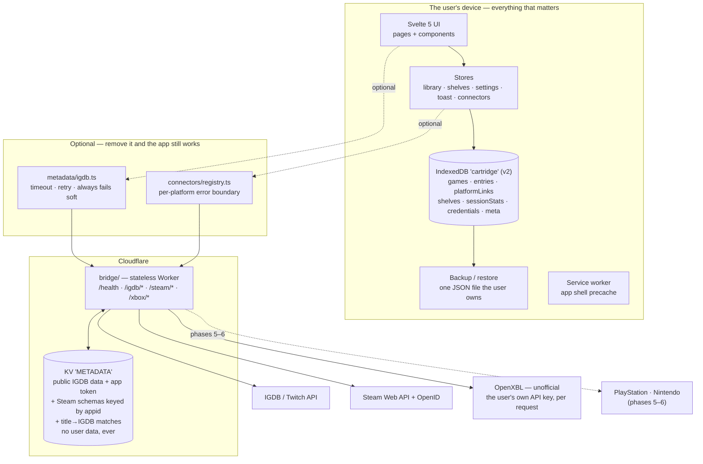

# Cartridge — architecture

## The four non-negotiables

Everything below exists to serve these. If a change breaks one of them, the change is
wrong, however convenient it is.

1. **The app works fully offline with zero connectors attached.**
   Not "degrades gracefully" — *works*. Boot, add a game, shelve it, rate it, review it,
   search it, back it up: all of it, with no network and no accounts. Enforced by
   `src/lib/offline.test.ts`, which stubs `fetch` to reject and asserts it is never called.

2. **No credential leaves the device except to the bridge, per request.**
   Platform credentials live in IndexedDB on the user's device. A connector may send one to
   the bridge to make a call that requires it, for the duration of that call. Nothing else.

3. **The bridge never persists a user's library.**
   It caches public IGDB metadata and its own Twitch app token. It has no endpoint that
   accepts user data, no cookies, no identifiers, no request-body logs.

4. **A failing connector degrades one tab, never the whole app.**
   Enforced structurally by `src/lib/connectors/registry.ts`, which catches everything a
   connector can throw, records it against that platform alone, and returns it as a value.
   Proven by `registry.test.ts`.

## The shape of it

The dotted edges are the whole design: everything outside `device` can be deleted and the
product still does its job.

## Layers

| Layer | Path | Rule |
| --- | --- | --- |
| Types | `src/lib/types.ts` | The domain vocabulary. No behaviour. |
| Storage | `src/lib/storage/db.ts` | The only module that touches IndexedDB. |
| Backup | `src/lib/storage/backup.ts` | The `cartridge/backup` envelope, and the guard against restoring a foreign file. |
| Stores | `src/lib/stores/*` | The only thing components talk to for data. Writes go to `db` first, then refresh. |
| Pure logic | `src/lib/library/*`, `markdown.ts`, `util.ts`, `metadata/match.ts` | No DOM, no IO. Unit-tested directly. |
| Metadata | `src/lib/metadata/*` | The only code in the app that makes a network request. |
| Connectors | `src/lib/connectors/*` | Interface + error boundary + implementations. `sync.ts` is pure; `apply.ts` is the only writer. |
| UI | `src/lib/components/*`, `src/lib/pages/*` | Presentation. Never reaches past a store. |
| Bridge | `bridge/` | Separate deployable, own tsconfig, own release cadence. |

## Data model

IndexedDB database `cartridge`, version 2. Every record carries `id`, `createdAt`,
`updatedAt` and an optional `deleted` tombstone — the per-entity last-writer-wins shape
`score-king` uses. Nothing merges yet, but backups already round-trip tombstones, so a
future sync layer drops in without a migration.

| Store | Key | Indexes | Holds |
| --- | --- | --- | --- |
| `games` | `id` | `bySortTitle`, `byIgdbId` | Canonical metadata, authored or IGDB-sourced. |
| `platformLinks` | `id` | `byGame`, `byPlatform` | Game ↔ Steam appid / Xbox titleId / PSN id / Nintendo id. |
| `entries` | `id` | `byGame`, `byStatus`, `byUpdated` | The user's relationship to a game. |
| `shelves` | `id` | `byOrder` | Five built-ins plus custom. |
| `sessionStats` | `id` | `byGame` | Synced playtime, last-played, achievements. |
| `credentials` | `platform` | — | Platform credentials — for Steam a 64-bit account id, for Xbox the user's own OpenXBL API key plus their XUID and gamertag. **Excluded from backup and restore.** |
| `meta` | `key` | — | Schema version and app-level odds and ends. |

`credentials` (added in v2) is deliberately outside the backup envelope. A backup is a file
people email themselves and drop in cloud storage; an account credential does not belong in
one, and re-connecting a platform takes two clicks. Phase 4 made that reasoning literal rather
than precautionary: Xbox's credential is a long-lived API key, not a public account number.
The visible cost is that a restore brings
back platform links with no account behind them, so `needsReconnect` derives that state from
the library and shows a reconnect prompt rather than letting a sync silently do nothing.

Deletes are **tombstoned cascades**: removing a game marks the game, its entry, its links
and its stats as deleted rather than dropping rows, so a restore on another device learns
about the deletion too.

The whole library is loaded into memory on boot. A personal games library is small, and
holding it in memory is what makes search instant and every screen work offline.

## The bridge

A stateless Cloudflare Worker. It exists because IGDB requires a client secret a static PWA
cannot hold, and because neither the Steam Web API nor OpenXBL will answer a browser directly.

- **Auth**: Twitch client-credentials, token cached in KV until shortly before expiry,
  never returned to the client. Xbox needs no bridge secret — the key is the user's and
  arrives per request.
- **Normalization**: IGDB responses are mapped to Cartridge's `GameMetadata` in the worker.
  The app never sees an IGDB field name, so an upstream schema change is a bridge deploy.
- **Cache**: search 24h, game 7d in KV; `Cache-Control` echoed to the browser. Steam
  achievement schemas and appid → IGDB mappings cache for 30 days, keyed by appid, and
  title → IGDB matches for 7 days keyed by the normalised title — public
  facts about a game, not about a person.
- **Hardening**: exact-match CORS allowlist, `GET` only, bounded input, per-IP throttle, one
  error envelope, no upstream stack traces.

The allowlist stops browsers, not `curl` — `Origin` is a header, and a header is whatever the
sender says it is. So a deployed bridge is, in practice, an open Steam and IGDB proxy backed
by the deployer's keys for anyone who learns the URL and an allowed origin. Closing that needs
real authentication, which needs an account system Cartridge deliberately doesn't have.
`bridge/README.md`'s "Residual risk" section spells this out so nobody deploys it without
knowing. Xbox is the exception that proves the shape of the problem: there is no bridge-held
Xbox key to spend, so `/xbox/*` is useless to a caller who hasn't brought their own.

**No cache key contains a SteamID, an XUID or an OpenXBL key, and no user's library is ever
written to KV.** A library and its playtime are personal, and the whole point of the bridge is
that it brokers keys, not that it holds data. Steam and Xbox library calls pass straight
through, `no-store`.

See `bridge/README.md` for the secrets and how to obtain them.

## Connectors

A connector answers four questions about a platform — who you are, what you own, what you've
played lately, and how far through the achievements you are — and nothing else. The registry
wraps every call in a boundary that turns a throw into a value, so a platform that is down,
rate-limited or returning nonsense degrades that platform's tab and nothing else.

Syncing is deliberately two steps:

1. **Plan** — `connectors/sync.ts`, pure. Takes the library, what the platform reports and
   what IGDB matched, and returns a `SyncPlan`: what would be added, what already exists and
   would gain a link, what is unchanged, what couldn't be identified. No DOM, no IndexedDB,
   no network — which is why the rules that matter can be proven rather than promised.
2. **Apply** — `connectors/apply.ts`, a thin writer. Creates games, links and stats; creates
   an `Entry` for a genuinely new game and **never modifies an existing one**. A plan has no
   vocabulary for changing a rating, a review, a status or a shelf, so it cannot.

Identification runs in descending order of trust: an existing platform link, then a shared
IGDB id, then `metadata/match.ts`'s conservative title matcher. `null` is a good answer — an
unrecognised game becomes a new row, which is a small annoyance, where a wrong match silently
merges two games and takes a rating and a review with it.

### Steam (phase 3)

| Piece | Where |
| --- | --- |
| Sign-in | Steam OpenID 2.0, verified in the worker. The app redirects to `/steam/login`, Steam returns to `/steam/return`, and the bridge answers by redirecting back with `#steam_id=…` in the fragment — which browsers never send to a server. |
| Verification | `openid.mode`, `op_endpoint`, `return_to` and a `check_authentication` round-trip to Steam that must answer `is_valid:true`. The redirect's own parameters are never trusted. |
| Credential | A 64-bit SteamID. That is the entire secret, and it is public information. |
| Data | `GetOwnedGames`, `GetRecentlyPlayedGames`, `GetPlayerAchievements` + `GetSchemaForGame`. |
| Matching | `/igdb/by-steam` resolves appids through IGDB's `external_games`, so matching is near-exact rather than by title. |
| Private profiles | Steam answers `{"response":{}}` with HTTP 200. The bridge detects it and returns `403 steam-private` with a help URL; the app shows the exact privacy setting to change. |

### Xbox (phase 4)

The second connector, and the one that tested whether the interface generalised. It mostly
did: three **additive** changes were all it needed — `Capabilities.playtimeCoverage`,
`ConnectorGame.achievements` and `SyncPlan.matchingIncomplete`. Each is documented where it is
declared, with the Xbox fact that forced it.

| Piece | Where |
| --- | --- |
| API | [OpenXBL](https://xbl.io/), an **unofficial** third-party proxy over Xbox Live. There is no public Microsoft alternative. `capabilities.official` is `false` and the UI says so. |
| Credential | The user's **own** free OpenXBL API key, created with their Microsoft login. Sent in an `X-XBL-Key` header — a header rather than a query parameter so a long-lived secret stays out of URLs, access logs and history. The bridge holds no Xbox secret at all. |
| Data | `/account`, `/player/titleHistory` (games, last-played **and** achievement counts inline), `/player/stats` (minutes, batched), `/achievements/player/{xuid}/{titleId}`. |
| Budget | 150 requests/hour on the free tier. A full sync is about three, because achievements ride along with the library and playtime batches. A throttled sync keeps what it fetched instead of failing whole. |
| Matching | **The hard part.** IGDB carries no Xbox title ids, so games are matched by title through `/igdb/by-title` at ≥ 0.94 similarity *and* 0.06 clear of the runner-up. An ambiguous title is refused, imported under Xbox's own name, and listed for review on the import screen. |
| Playtime | Often absent — `null` → "Not reported". Never a fabricated `0`, and never allowed to erase a figure a previous sync already recorded. |
| Ownership | Title history is what has been *played*, not what is *owned*. A never-launched purchase is simply absent, and Cartridge does not invent it. |

## Failure modes, and what the user sees

| What breaks | What happens |
| --- | --- |
| No network | Everything works. The service worker serves the shell; the library is local. |
| No bridge configured | Metadata search is replaced by one line explaining manual entry. |
| Bridge down or slow | 8s timeout, one retry, then an empty result and "add it by hand". |
| IndexedDB unavailable | A persistent banner says so, out loud, before the user types a review that won't survive. |
| One connector throws | That platform shows as degraded. Every other platform, and the whole local app, is unaffected. |
| A Steam profile is private | A named error state explaining which setting to change, with a link straight to it — not a generic toast. |
| Steam rate-limits mid-sync | Achievements stop being fetched; the library import finishes with what it has. |
| OpenXBL rate-limits mid-sync | Playtime is dropped, the library still imports, and figures a previous sync recorded are kept rather than blanked. |
| OpenXBL returns nonsense | Rejected as unsupported at the shape check. Xbox degrades; Steam and the local library are untouched — proven in `cross-platform.test.ts`. |
| A title can't be matched confidently | It imports under its Xbox name and art, and is listed on the import screen for review. Nothing is guessed. |
| A game fails to import | It's listed as failed in the per-title results. The other nine hundred still land. |
| A backup is restored on a new device | The library comes back whole; platform links with no credential behind them raise a reconnect prompt instead of a sync that silently does nothing. |
| A backup file is wrong | The envelope check rejects it before anything is written. |

## The shared layer

Cartridge consumes the JRM Studio backbone rather than inventing its own foundations:

- **`vendor/@jrm/tokens`** — the DTCG token distribution, vendored verbatim from
  `jrmoulckers/studio` (registry-free "Option A" sync). `src/app.css` imports it and
  defines only short local aliases on top. No component hard-codes a colour or a spacing.
- **`.github/`** — synced canon from `jrmoulckers/.github`: agents, skills, prompts,
  instructions, reusable workflows and health files. Synced files carry a provenance header
  and must not be hand-edited.
- **`AGENTS.md`** — product-local rules, with the managed studio base between
  `<!-- studio:base:start -->` and `<!-- studio:base:end -->`.

**Needs human action:** `jrmoulckers/cartridge` is not yet a member in
`jrmoulckers/.github`'s `studio.config.json`. Until it is, the vendored tokens and canon are
a point-in-time copy rather than an automatically synced one. See `vendor/README.md`.

## Testing

`npm test` — Vitest, jsdom, no browser needed.

| Suite | What it protects |
| --- | --- |
| `markdown.test.ts` | The renderer emits no HTML it didn't generate. Includes XSS payloads. |
| `library/search.test.ts` | Search, facets, and the "unknown sorts last" rule. |
| `metadata/match.test.ts` | Title matching is conservative — it returns null rather than merging two different games. |
| `connectors/registry.test.ts` | A throwing connector degrades exactly one platform. |
| `connectors/sync.test.ts` | The phase-3 rules: an owned game gains a link instead of duplicating, a second sync is a no-op, user-authored data is never written, a real `0` stays `0` and an unknown stays `null`. |
| `connectors/steam.test.ts` | Steam's failure modes, with `fetch` stubbed: private profile, rate limit, garbage response, a game with no achievements. |
| `stores/connectors.test.ts` | The reconnect prompt: links without a credential ask for a reconnect, a disconnect doesn't, and it clears itself. |
| `storage/backup.test.ts` | A foreign or newer file is rejected before anything is written. |
| `offline.test.ts` | The whole local journey, with `fetch` stubbed to reject. |
| `router.test.ts` | Deep links resolve, unknown paths don't. |
