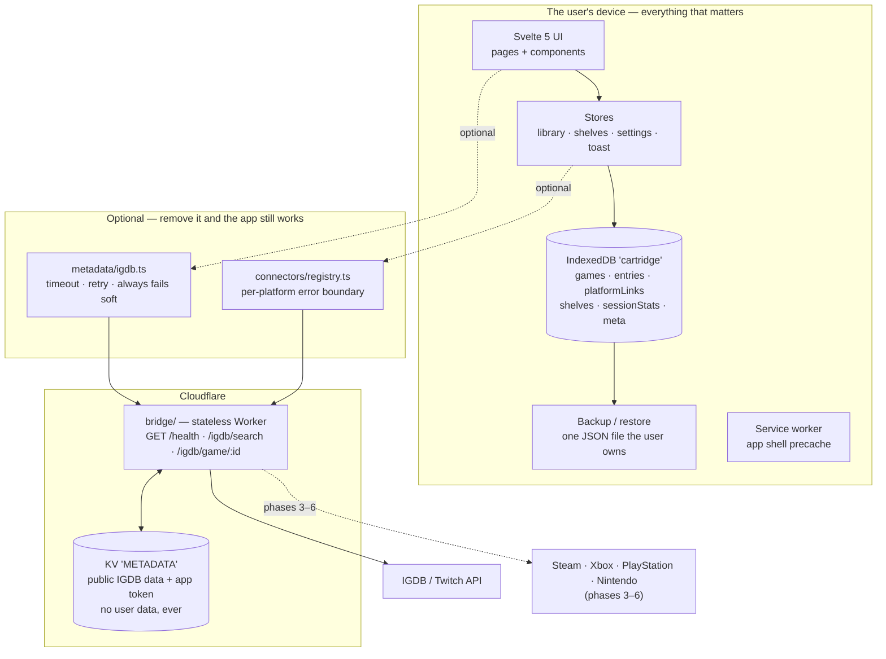

# Cartridge — architecture

## The four non-negotiables

Everything below exists to serve these. If a change breaks one of them, the change is
wrong, however convenient it is.

1. **The app works fully offline with zero connectors attached.**
   Not "degrades gracefully" — *works*. Boot, add a game, shelve it, rate it, review it,
   search it, back it up: all of it, with no network and no accounts. Enforced by
   `src/lib/offline.test.ts`, which stubs `fetch` to reject and asserts it is never called.

2. **No credential leaves the device except to the bridge, per request.**
   Platform credentials live in IndexedDB on the user's device. A connector may send one to
   the bridge to make a call that requires it, for the duration of that call. Nothing else.

3. **The bridge never persists a user's library.**
   It caches public IGDB metadata and its own Twitch app token. It has no endpoint that
   accepts user data, no cookies, no identifiers, no request-body logs.

4. **A failing connector degrades one tab, never the whole app.**
   Enforced structurally by `src/lib/connectors/registry.ts`, which catches everything a
   connector can throw, records it against that platform alone, and returns it as a value.
   Proven by `registry.test.ts`.

## The shape of it

The dotted edges are the whole design: everything outside `device` can be deleted and the
product still does its job.

## Layers

| Layer | Path | Rule |
| --- | --- | --- |
| Types | `src/lib/types.ts` | The domain vocabulary. No behaviour. |
| Storage | `src/lib/storage/db.ts` | The only module that touches IndexedDB. |
| Backup | `src/lib/storage/backup.ts` | The `cartridge/backup` envelope, and the guard against restoring a foreign file. |
| Stores | `src/lib/stores/*` | The only thing components talk to for data. Writes go to `db` first, then refresh. |
| Pure logic | `src/lib/library/*`, `markdown.ts`, `util.ts`, `metadata/match.ts` | No DOM, no IO. Unit-tested directly. |
| Metadata | `src/lib/metadata/*` | The only code in the app that makes a network request. |
| Connectors | `src/lib/connectors/*` | Interface + error boundary. No implementations yet. |
| UI | `src/lib/components/*`, `src/lib/pages/*` | Presentation. Never reaches past a store. |
| Bridge | `bridge/` | Separate deployable, own tsconfig, own release cadence. |

## Data model

IndexedDB database `cartridge`, version 1. Every record carries `id`, `createdAt`,
`updatedAt` and an optional `deleted` tombstone — the per-entity last-writer-wins shape
`score-king` uses. Nothing merges yet, but backups already round-trip tombstones, so a
future sync layer drops in without a migration.

| Store | Key | Indexes | Holds |
| --- | --- | --- | --- |
| `games` | `id` | `bySortTitle`, `byIgdbId` | Canonical metadata, authored or IGDB-sourced. |
| `platformLinks` | `id` | `byGame`, `byPlatform` | Game ↔ Steam appid / Xbox titleId / PSN id / Nintendo id. |
| `entries` | `id` | `byGame`, `byStatus`, `byUpdated` | The user's relationship to a game. |
| `shelves` | `id` | `byOrder` | Five built-ins plus custom. |
| `sessionStats` | `id` | `byGame` | Synced playtime, last-played, achievements. |
| `meta` | `key` | — | Schema version and app-level odds and ends. |

Deletes are **tombstoned cascades**: removing a game marks the game, its entry, its links
and its stats as deleted rather than dropping rows, so a restore on another device learns
about the deletion too.

The whole library is loaded into memory on boot. A personal games library is small, and
holding it in memory is what makes search instant and every screen work offline.

## The bridge

A stateless Cloudflare Worker. It exists because IGDB requires a client secret and a static
PWA cannot hold one.

- **Auth**: Twitch client-credentials, token cached in KV until shortly before expiry,
  never returned to the client.
- **Normalization**: IGDB responses are mapped to Cartridge's `GameMetadata` in the worker.
  The app never sees an IGDB field name, so an upstream schema change is a bridge deploy.
- **Cache**: search 24h, game 7d in KV; `Cache-Control` echoed to the browser.
- **Hardening**: exact-match CORS allowlist, `GET` only, bounded input, per-IP throttle, one
  error envelope, no upstream stack traces.

See `bridge/README.md` for the secrets and how to obtain them.

## Failure modes, and what the user sees

| What breaks | What happens |
| --- | --- |
| No network | Everything works. The service worker serves the shell; the library is local. |
| No bridge configured | Metadata search is replaced by one line explaining manual entry. |
| Bridge down or slow | 8s timeout, one retry, then an empty result and "add it by hand". |
| IndexedDB unavailable | A persistent banner says so, out loud, before the user types a review that won't survive. |
| One connector throws | That platform shows as degraded. Every other platform, and the whole local app, is unaffected. |
| A backup file is wrong | The envelope check rejects it before anything is written. |

## The shared layer

Cartridge consumes the JRM Studio backbone rather than inventing its own foundations:

- **`vendor/@jrm/tokens`** — the DTCG token distribution, vendored verbatim from
  `jrmoulckers/studio` (registry-free "Option A" sync). `src/app.css` imports it and
  defines only short local aliases on top. No component hard-codes a colour or a spacing.
- **`.github/`** — synced canon from `jrmoulckers/.github`: agents, skills, prompts,
  instructions, reusable workflows and health files. Synced files carry a provenance header
  and must not be hand-edited.
- **`AGENTS.md`** — product-local rules, with the managed studio base between
  `<!-- studio:base:start -->` and `<!-- studio:base:end -->`.

**Needs human action:** `jrmoulckers/cartridge` is not yet a member in
`jrmoulckers/.github`'s `studio.config.json`. Until it is, the vendored tokens and canon are
a point-in-time copy rather than an automatically synced one. See `vendor/README.md`.

## Testing

`npm test` — Vitest, jsdom, no browser needed.

| Suite | What it protects |
| --- | --- |
| `markdown.test.ts` | The renderer emits no HTML it didn't generate. Includes XSS payloads. |
| `library/search.test.ts` | Search, facets, and the "unknown sorts last" rule. |
| `metadata/match.test.ts` | Title matching is conservative — it returns null rather than merging two different games. |
| `connectors/registry.test.ts` | A throwing connector degrades exactly one platform. |
| `storage/backup.test.ts` | A foreign or newer file is rejected before anything is written. |
| `offline.test.ts` | The whole local journey, with `fetch` stubbed to reject. |
| `router.test.ts` | Deep links resolve, unknown paths don't. |
